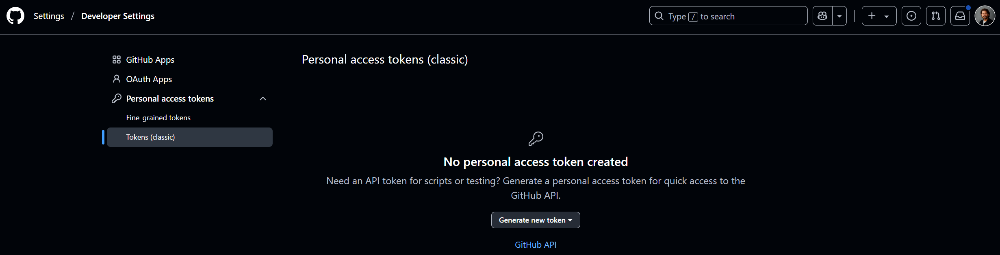
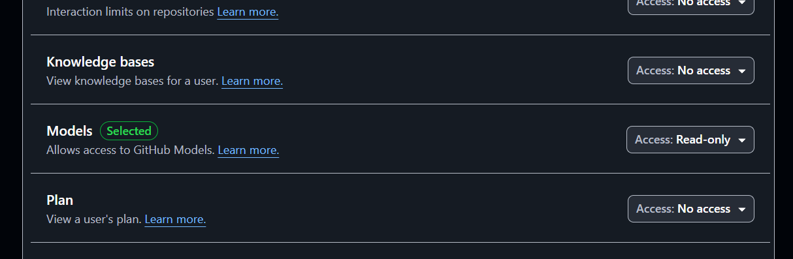

# Environment Setup

## Create a Virtual Environment
### For Conda Users

If you have Conda installed, you can create a virtual environment using the following commands:

```sh
conda create --name ai-agents python=3.12
conda activate ai-agents
```

### For Users Without Conda

If you do not have Conda installed, you can create a virtual environment using `venv`:

```sh
python -m venv ai-agents
source ai-agents/bin/activate  # On Windows use `ai-agents\Scripts\activate`
```

Now, create a copy of the `.env.example` & save it as `.env`

## Install Required Packages

To ensure you have all the required Python packages to run the code, run the following command in your terminal.

We recommend creating a Python virtual environment to avoid any conflicts and issues.

```sh
pip install -r requirements.txt
```

This should install the required Python packages.

## Retrieve Your GitHub Personal Access Token (PAT)

We'll use **Github Models Marketplace** to get free access to Large Language Models (LLMs) that will be used to create AI Agents.

To access this service, you will need to create a **GitHub Personal Access Token (PAT)**.

This can be done by going to your [Personal Access Tokens settings](https://github.com/settings/personal-access-tokens) in your GitHub Account.

Select the `Fine-grained tokens` option on the left side of your screen.

Then select `Generate new token`.



Add a **Token Name** & within **Permissions**, select `Read-only` access for **Models**. Then click `Generate token`.



Copy your PAT *immediately* & add it to the `.env` file.


## Get API Keys for Tools

### Serper - Web Search API

Create a FREE account on [Serper.dev](https://serper.dev/)

Now, copy the API Key from the dashboard & paste it into the `.env` file.


### Firecrawl - Web Scraping API

Sign up for a FREE account on [Firecrawl.dev](https://www.firecrawl.dev/) with your Google account.

Now, copy the API Key from the dashboard & paste it into the `.env` file.

### Typefully - Tweet Scheduling

Log in with your Twitter/X account on [Typfully](https://typefully.com/)

Click on your profile image > Manage Accounts > API & Integrations

Now, copy the API Key & paste it into the `.env` file.
