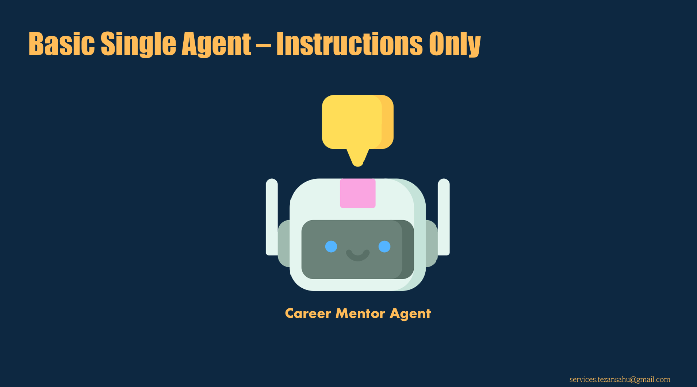
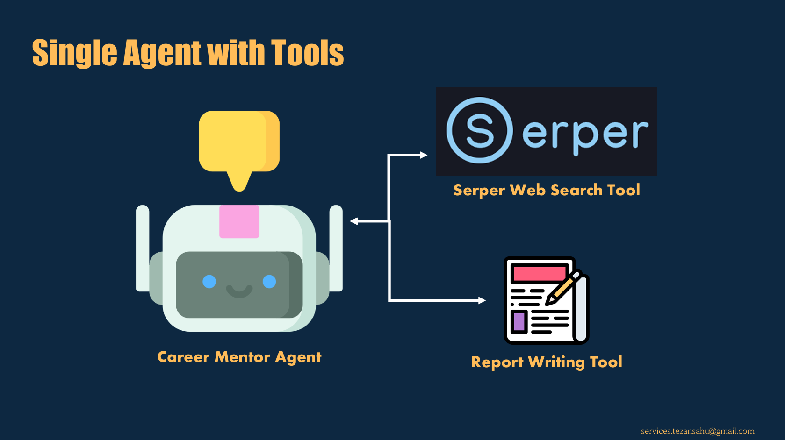
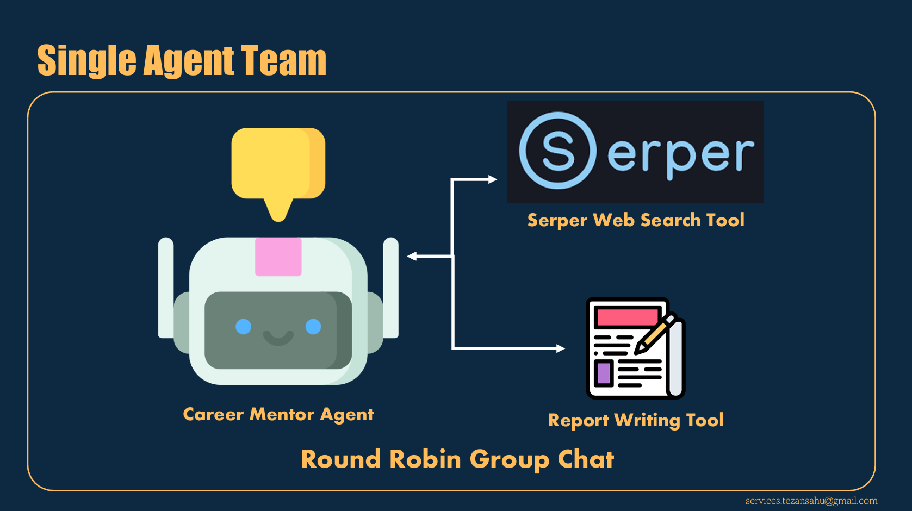
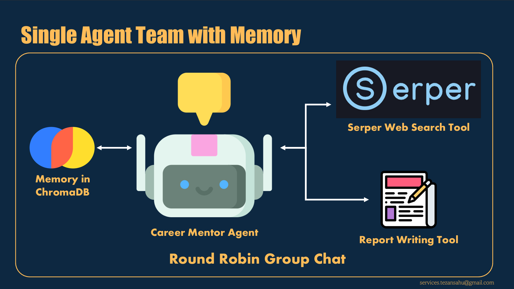
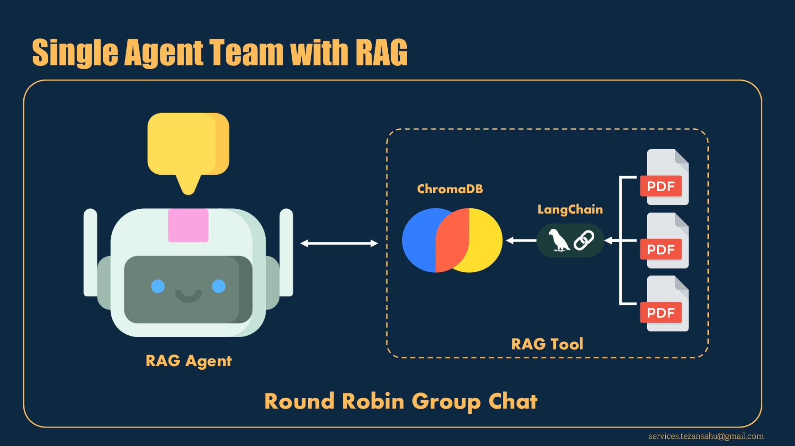

# Single Agent Systems

This folder contains various implementations of single-agent systems, showcasing different capabilities and functionalities. Each script demonstrates a unique aspect of single-agent systems, ranging from basic setups to advanced configurations with tools, memory, and retrieval-augmented generation (RAG).

## Contents

### **[1.1-basic-single-agent.py](1.1-basic-single-agent.py)**  
   A basic implementation of a single-agent system with just a persona.

   

### **[1.2-single-agent-with-tools.py](1.2-single-agent-with-tools.py)**  
   Demonstrates a single agent equipped with tools for enhanced functionality.

   

### **[1.3-single-agent-team.py](1.3-single-agent-team.py)**  
   Implements a single agent (with tools) that can execute with self-looping, to enable the use of multiple tools sequntially in addressing the user's query.

   

### **[1.4-single-agent-team-with-memory.py](1.4-single-agent-team-with-memory.py)**  
   Adds vector-based memory capabilities to the single-agent (team) for better contextual answering.

   

### **[1.5-single-agent-team-with-RAG.py](1.5-single-agent-team-with-RAG.py)**  
   Integrates retrieval-augmented generation (RAG) into the single-agent team for improved information retrieval and generation.

   

## Prerequisites

Ensure you have the following installed:
- Python 3.10 or higher
- Required dependencies listed in the [requirements.txt](../0-Environment-Setup/requirements.txt)

To install the dependencies, run:
```bash
pip install -r ../0-Environment-Setup/requirements.txt
```

## How to Run the Scripts

1. Navigate to this folder:
   `cd 1-Single-Agent-System`

2. Run the desired script using Python:
   `python <script_name>.py`

   Example: `python 1.1-basic-single-agent.py`

