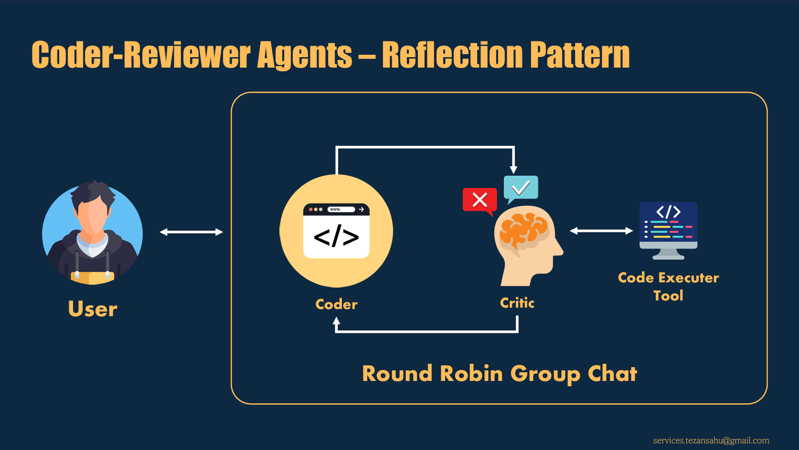
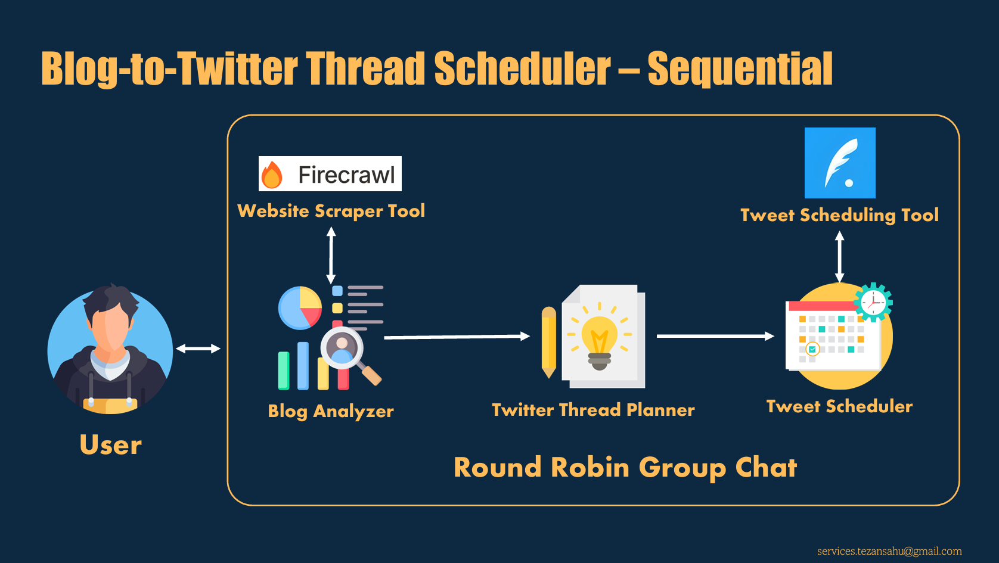
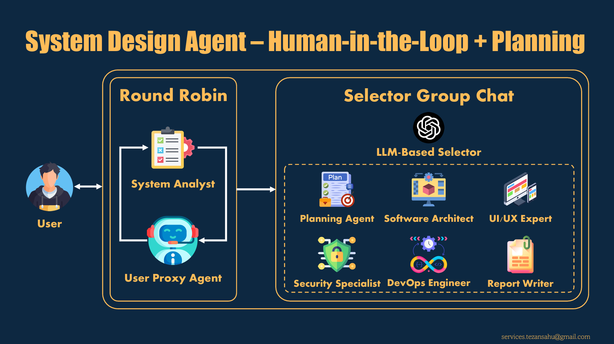
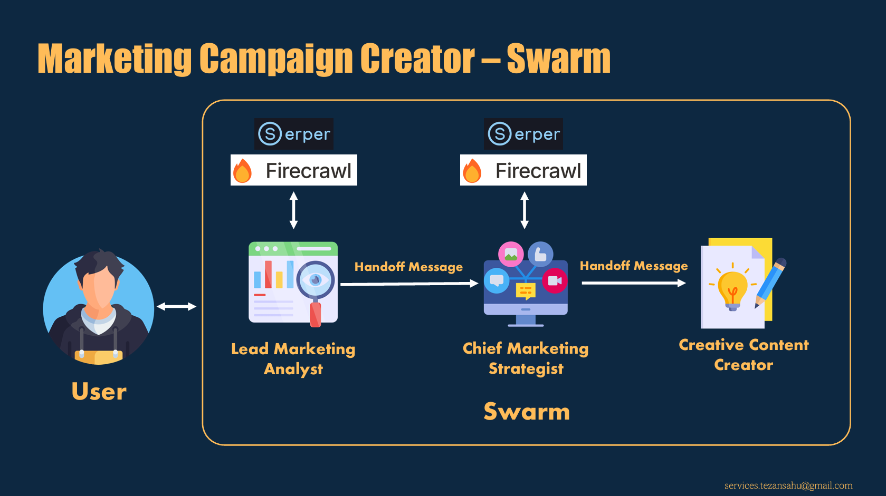

# Multi-Agent Systems

This folder contains implementations of multi-agent systems, showcasing collaborative and distributed problem-solving capabilities. 

Each script demonstrates unique use cases where multiple agents work together to achieve complex tasks.

## Contents

### **[2.1-reflection-coder-reviewer.py](2.1-reflection-coder-reviewer.py)**  
   Implements a coder-reviewer system where one agent writes code, and another reviews and validates it. Th convrsation continus in a round-robin fashion until th coder agent addresses all th feedback from the reviewr agent.
   
   This demonstrates the **Reflection** pattern of agentic design.

   

### **[2.2-sequential-blog-to-tweet-thread-scheduler.py](2.2-sequential-blog-to-tweet-thread-scheduler.py)**  
   A sequential multi-agent system that converts a blog into a Twitter thread and schedules it for posting, using 3 agents:
   - Blog Analyzer
   - Twitter Thread Planner
   - Tweet Scheduler

   This demonstrates the **Tool-Use** pattern of agentic design.

   

### **[2.3-planning-with-HiTL-system-design.py](2.3-planning-with-HiTL-system-design.py)**  
   A human-in-the-loop (HiTL) system design agent that collaborates with a planner that coordinates between multiple specialized agents to create a system design document, using 7 agents:
   - Planning Agent
   - System Analyst
   - Senior System Architect
   - UI/UX Specialist
   - Security Specialist
   - DevOps Engineer
   - Report Writer

   This demonstrates the **Planning** pattern of agentic design.

   

### **[2.4-swarm-marketing-campaign-creator.py](2.4-swarm-marketing-campaign-creator.py)**  
   A **swarm-based** system where agents collaborate to create a comprehensive marketing campaign, including competitor analysis, strategy formulation, and content creation. This involves 3 agents:
   - Lead Marketing Analyst
   - Chief Marketing Strategist
   - Creative Content Creator

   

## Prerequisites

Ensure you have the following installed:
- Python 3.10 or higher
- Required dependencies listed in the [requirements.txt](../0-Environment-Setup/requirements.txt)

To install the dependencies, run:
```bash
pip install -r ../0-Environment-Setup/requirements.txt
```

## How to Run the Scripts

1. Navigate to this folder:
  `cd 2-Multi-Agent-System`

2. Run the desired script using Python:
   `python <script_name>.py`

   Example: `python 2.1-reflection-coder-reviewer.py`
