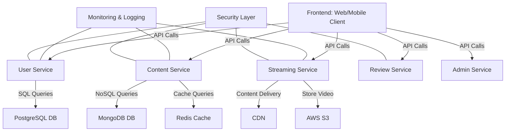

# Netflix Clone Design Document

## Introduction
This document outlines the design and architectural considerations for creating a Netflix clone. It encompasses the functional and non-functional requirements, UI/UX design recommendations, security measures, deployment strategies, maintenance protocols, and telemetry solutions aimed at delivering a robust video streaming service.

## Requirements

### Functional Requirements
1. **User Registration and Authentication**
   - Account creation (email/password, social media logins)
   - Password recovery mechanisms.

2. **Content Management**
   - Browsing and search capabilities for movies/TV shows
   - Personalized recommendations based on viewing history
   - User playlists or watchlists
   - Title metadata (synopsis, genres, ratings).

3. **Streaming**
   - Multiple streaming quality support (SD, HD, 4K)
   - Adaptive streaming based on user’s bandwidth
   - "Resume watching" feature.

4. **User Interaction**
   - User reviews and ratings for content
   - Family profiles with parental controls
   - Download options for offline viewing.

5. **Administration**
   - Admin functionalities for content upload and management
   - Engagement analytics dashboard.

### Non-Functional Requirements
1. **Performance**
   - Support thousands of concurrent users
   - Reduce latency for streaming (target < 2 seconds buffering).

2. **Scalability**
   - Horizontal scalability to accommodate growing users and content.

3. **Security**
   - Strong data protection for user data and secure content delivery.

4. **Usability**
   - Intuitive UI/UX design
   - Compatibility with multiple devices (smartphones, tablets, smart TVs, desktops).

5. **Availability**
   - High availability with a minimal downtime goal of 99.9%.

## High-Level Architecture

### Key Components
- **Frontend**: Responsive UI using React or Angular.
- **Backend Services**: 
  - User, Content, Streaming, Review, and Admin Services.
- **Database**: PostgreSQL and MongoDB; Cache with Redis.
- **Content Delivery Network (CDN)**: AWS CloudFront or Akamai.
- **Media Storage**: AWS S3.
- **Security Layer**: Data encryption and DRM integration.
- **Monitoring and Logging Tools**: Prometheus and Grafana.

### Architecture Diagram

## UI/UX Design Recommendations
1. **User Registration**: Clear forms, inline validation, and accessibility features.
2. **Content Browsing**: Implement a grid layout with advanced search and filter options.
3. **Personalized Recommendations**: Prominently display personalized suggestions.
4. **Playback Features**: Design intuitive video player controls and ensure a responsive layout.
5. **User Interaction**: Streamlined review submission and watchlist management.

## Security Measures
1. **User Registration**: Use bcrypt for password storage and implement MFA.
2. **Secure Communication**: Enforce HTTPS and secure WebSockets.
3. **Data Protection**: Encrypt sensitive data using AES-256 and use JWT for session management.
4. **Access Control**: Implement RBAC and API rate limiting.
5. **Content Delivery Security**: Integrate DRM and use signed URLs for access control.

## Deployment Strategies
1. **Infrastructure as Code**: Manage infrastructure with Terraform.
2. **Containerization**: Utilize Docker for service isolation.
3. **Orchestration**: Implement Kubernetes for container management.
4. **Canary Releases**: Test updates with canary releases for risk mitigation.

## Maintenance Strategies
1. **Automated Backups**: Schedule periodic backups for critical data.
2. **Patch Management**: Maintain an update schedule for dependencies.
3. **Performance Optimization**: Regularly assess and optimize performance.
4. **Load Testing**: Conduct load tests to identify bottlenecks.

## Telemetry Strategies
1. **Monitoring**: Use Prometheus for metrics and Grafana for dashboards.
2. **Logging**: Centralize logs with the ELK Stack for better tracking.
3. **Alerting**: Set up alerts for unusual system metrics.
4. **User Behavior Analytics**: Analyze user engagement data for insights.

## Conclusion
The design document presents a thorough blueprint for developing a Netflix clone with a solid framework addressing functionality, security, and scalability. By following these guidelines and carefully implementing each aspect, the resulting service should provide a secure and enjoyable user experience.