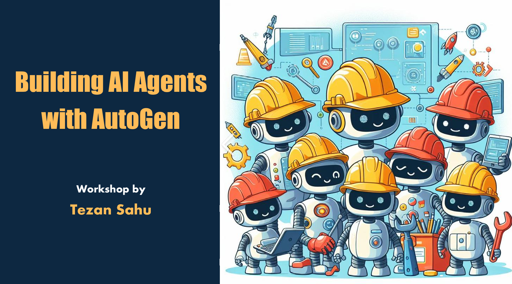

# Building AI Agents with AutoGen

This repository demonstrates the implementation of AI agents using the AutoGen framework, to accompany the workshop **Building AI Agents with AutoGen**.

It showcases various single-agent and multi-agent systems, as well as a user interface for interacting with these agents. 

Each system is designed to solve specific tasks, ranging from career mentoring to collaborative system design and marketing campaign creation.

## Project Structure

The project is organized into the following directories:

### **[Module 0: Environment Setup](0-Environment-Setup/)**  

Contains setup instructions, dependencies, and environment configuration files.

### **[Module 1: Single-Agent Systems](1-Single-Agent-System/)**  

Demonstrates the capabilities of single-agent systems with various enhancements like tools, memory, and retrieval-augmented generation (RAG).

### **[Module 2 Multi-Agent Systems](2-Multi-Agent-System/)**  

Implements collaborative multi-agent systems for complex tasks like system design, marketing campaigns, and code review, demonstrating various agentic patterns.

### **[Module 3: UI for AI Agents](3-UI-For-AI-Agents/)**  

Provides a user interface for interacting with AI agents using Chainlit.
